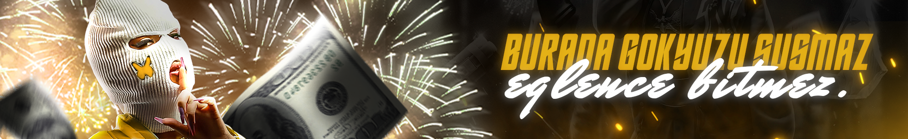

# NESOI Network

**NESOI Network** is a developer collective focused on building high-quality gaming infrastructure and software solutions.

We create tools for Minecraft and FiveM ecosystems with a strong focus on performance, reliability, and excellent user experience.

## About Us

NESOI Network develops **both open-source projects** that benefit the community and **premium SaaS solutions** that serve larger communities and businesses.

Our goal is to deliver robust, well-maintained tools that help server owners and developers succeed.

## Featured Projects

- **[NClaim](https://github.com/nesoi-network/NClaim)** — Advanced chunk claiming system for Minecraft (Open Source)
- **[FiveM Web Panel](https://demo.nesoinetwork.com)** — Modern server management panel for FiveM (SaaS)
- **Custom Development** — Tailored solutions for communities and businesses

Explore our public repositories → [NESOI Network Repositories](https://github.com/orgs/Nesoi-Network/repositories)

## Contributing

We welcome contributions to our open-source projects.

Feel free to fork the repositories, submit issues, or open Pull Requests. We appreciate every contribution.

## Contact

- **Discord:** [discord.gg/nesoi](https://discord.gg/nesoi)
- **Website:** [nesoinetwork.com](https://nesoinetwork.com/)
- **Instagram:** [@nesoicompany](https://instagram.com/nesoicompany)
- **TikTok:** [@nesoinetwork](https://tiktok.com/@nesoinetwork)
- **X (Twitter):** [@nesoinetwork](https://x.com/nesoi_network)
- **Email:** [contact@nesoinetwork.com](mailto:contact@nesoinetwork.com)

---

**Powering the next generation of game servers.**
